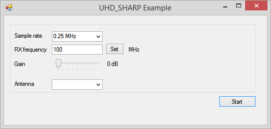
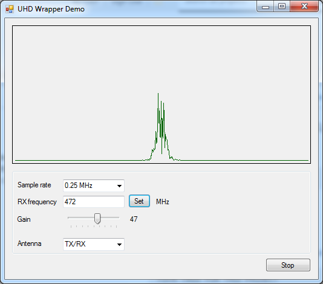

# uhdsharp
uhdsharp repository on GitHub. Moved from [CodePlex](https://uhdsharp.codeplex.com)

# What is UHD-SHARP?

Ettus Research has great SDR. For which it supplies C++ API. UHD_SHARP library designed to lower barriers to entry for beginners and amateurs into B200/B210 world. This is achieved by simplifying the API and taking care of all the nasty staff like buffering, multi-tasking and memory management. It uses C# as powerful, yet friendly platform.




# Quick start guide

If you can run your B200/B210 device on your Windows machine using UHD 3.8.0, then you probably be should be okay.
Otherwise follow these instructions:
* Download and install [ http://files.ettus.com/binaries/uhd/latest_release/uhd_003.008.000-release_Win32_VS2013.exe]( http://files.ettus.com/binaries/uhd/latest_release/uhd_003.008.000-release_Win32_VS2013.exe). Use the default options during installation
* Add UDH to your path
* Download and extract [release](https://github.com/CrazyAlex25/uhdsharp/releases/download/001/uhdsharp_beta_001.zip)
* Open new C# console application.
* Add UHD_SHARP.dll as a reference.
* Add the following code:

```csharp
using System;
using System.Collections.Generic;
using System.Linq;
using System.Text;
using System.Threading.Tasks;
using UHD_SHARP;

namespace ConsoleApplication1
{
    class Program
    {
        static multi_usrp usrp;

        static void Main(string[]() args)
        {
            usrp = new multi_usrp(); // Connect to the first device 
            if (!usrp.isConnected) {
                Console.WriteLine("Cannot connect to device.");
                return;
            }
            usrp.set_rx_rate(32e6); // RX rate = 32MHz
            usrp.set_rx_freq(100e6); // RX frequency = 100 MHz
            usrp.set_rx_gain(40); // RX gain = 40 dB
            usrp.DataReceiverEvent += OnDataReceiverEvent; // Wire RX event 
            Console.WriteLine("### Starting ### ");
            Console.WriteLine("Press any key to exit");
            usrp.begin_rx_stream(); // Start stream RX data
            Console.ReadKey();
        }

        static private void OnDataReceiverEvent(int[]()() real, int[]()() imaginary, int length, rx_metadata_t md)
        {
            // Your code goes here
            Console.Write(".");
        }

    }
}
```
